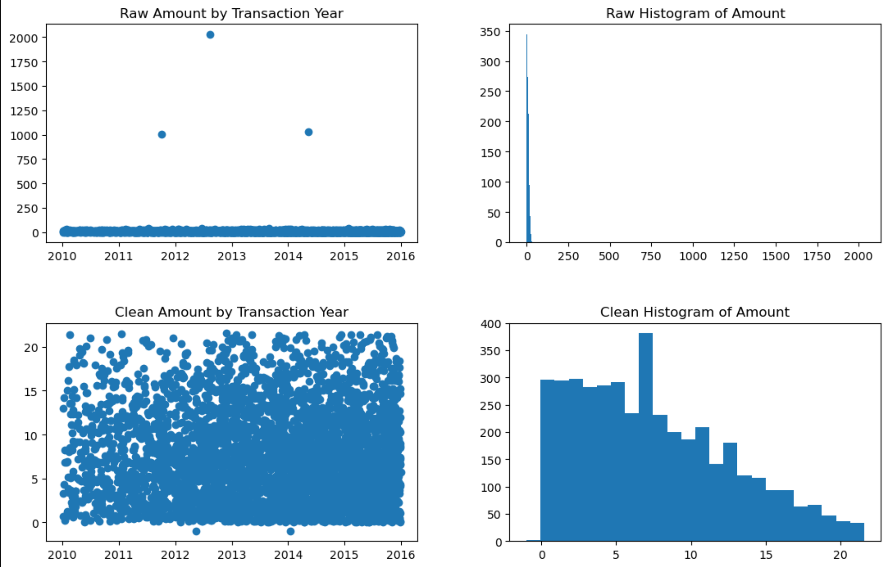
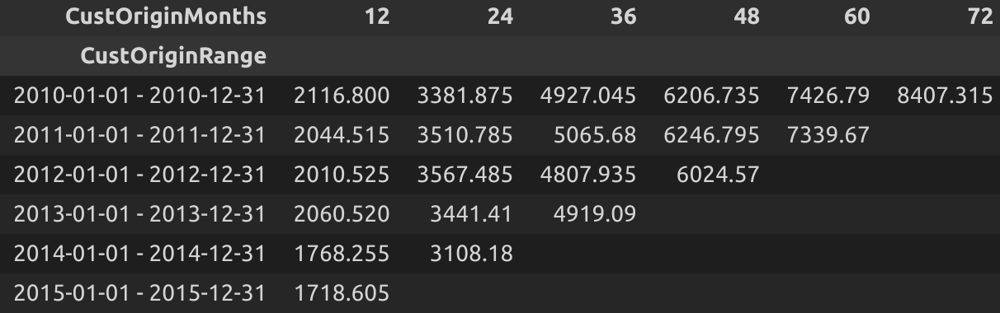
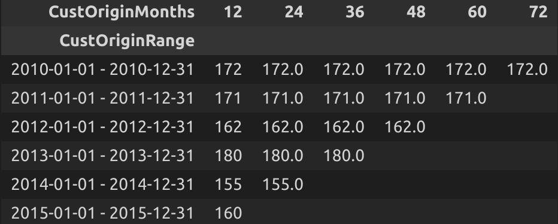
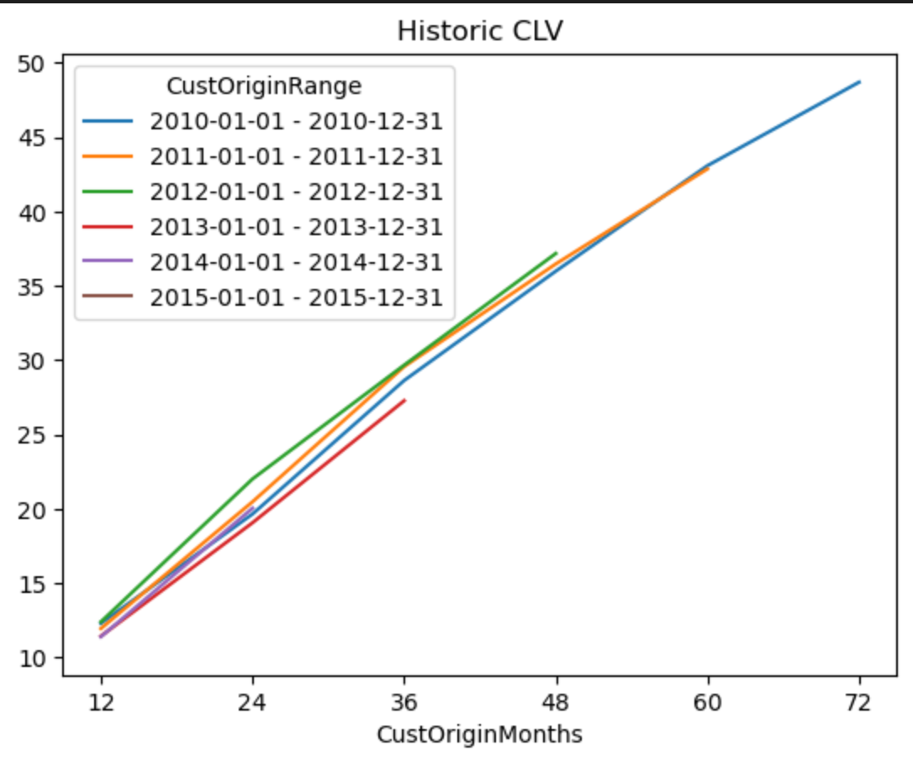

# Customer Lifetime Value (CLV)

Please note that this analysis was originally inspired by an article on gormanalysis.com. The dataset and outline for this project was provided by David Steier of Carnegie Mellon University.

Gormanalysis.com informs us that, "CLV is an estimation of the entire net profit attributed to a single customer. It's an important metric to understand because it helps businesses determine how much is too much to spend on advertising to acquire a single customer." 

The following analysis will demonstrate one method of calculating CLV. 

## Step 1: Understanding the dataset

To begin, I looked for missingness, date ranges for the transactions, unique number of customers, produced descriptitive statistics for the amount field, and checked if the amount spent increased or decreased over time. 

## Step 2: Exploring the dataset

In this step, a boxplot, scatter plot, and histogram were used in examining the amount field. There were several outliers in the dataset that needed to be removed.

During this phase, two methods were considered:
1. Median imputation
2. Isolation forest

Ultimately the solution employed an isolation forest with hyperparameter tuning.

## Step 3: Determining the origin year of customers

To determine the origin year of customers, the solution utilized the pandas groupby function. The records were group by customer ID and minimum of the transaction year. 

## Step 4: Calculating cumulative transaction amounts by origin year

The table rows show the cumulative amount by customer origin year

## Step 5: Calculating cumulative transaction amounts by new customers by origin year in each year

The table row shows the number of customers acquired in a origin year 

## Step 6: Calculating the historic CLV

This table essentially divides Step 4 by Step 5 to get the historic average CLV

## Step 7: Interpreting the results

Looking at the CLV chart curves, can expect new customers to have similar top line revenue into the future. Analysts can use historical trends to forecast into the future with reasonable accuracy, all else equal. 

One callout is that for the 12 months category, there is a decrease in historic CLV, evidenced by the decrease for $12 to $10. 